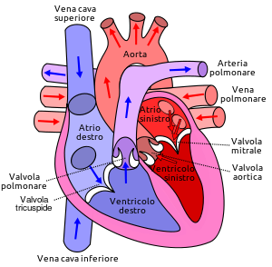
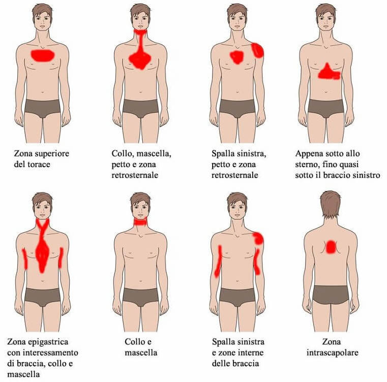
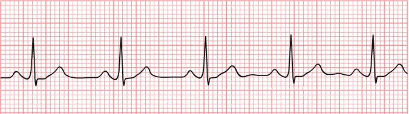
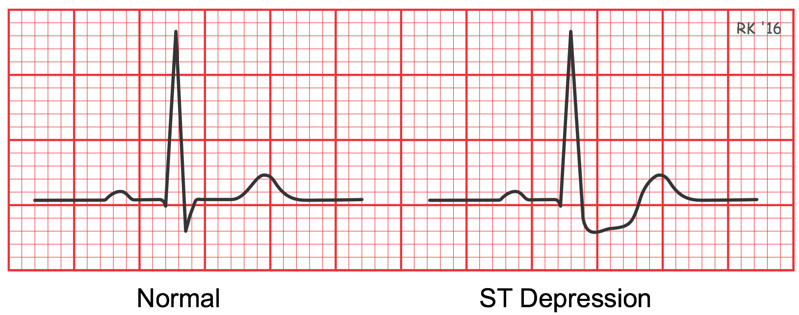
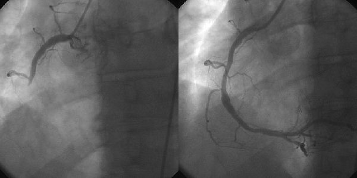

```{r setup, include=FALSE}
knitr::opts_chunk$set(cache = TRUE, message = FALSE, warning = FALSE)
```

## Introduzione

Fra le problematiche maggiormente osservate ad ogni fascia di età, di sicuro occupano un posto preponderante quelle di natura cardiovascolare. In particolare, in Italia sono la principale cause di morbosità, invalidità e mortalità. 
Il ruolo del cuore e dell'apparato circolatorio è, d'altronde, fondamentale e un suo malfunzionamento è in grado di compromettere lo svolgimento di ogni azione quotidiana. Non a caso, negli anni la ricerca medica ha compiuto grandi passi avanti nella ricerca, analisi, prevenzione e cura delle malattie cardiache.


### Come funziona il cuore?
Il cuore è una **pompa**: la sua funzione prevede il trasporto dell'essenziale sangue ricco di ossigeno al resto del corpo, ricevendo il sangue carico di anidride carbonica da inviare ai polmoni dove, in seguito, avviene la sua ossigenazione.

È posto nel torace, dietro lo sterno che lo protegge, posizionato leggermente a sinistra e poggiato sul diaframma. Inoltre, è caratterizzato dalla presenza di quattro cavità (atri e ventricoli) e quattro rispettive valvole che, come dei rubinetti, controllano l'unidirezionalità del flusso sanguigno.

A permettere lo scambio tra ossigeno e anidride carbonica sono i vasi sanguigni, fra cui i principali (detti *"Grandi Vasi"*) sono:

  1. le **vene** (cava inferiore e cava superiore) che portano il sangue carico di anidride carbonica dagli organi al cuore 
  2. l'**arteria** e la **vena polmonare**, che garantiscono il flusso di sangue tra cuore e polmoni
  3. l'**aorta**, che riporta e distribuisce il sangue carico di ossigeno all'organismo.
  
<center>
{width=350px}
</center> <br/>

Qualunque problematica che coinvolga il muscolo cardiaco e i vasi tramite i quali comunica con i tessuti e gli altri organi, si **riflette in immediato** sulla nostra vita quotidiana e, se trascurata, può comportare **danni irreversibili**.

La seguente analisi vuole quindi, in primis, individuare l'**influenza di vari fattori diagnostici** relativi alla comparsa di malattie cardiovascolari e, in conclusione, interrogarsi sulla possiblità di **prevedere possibili problematiche cardiache** da parte di strumenti tecnologici già oggi parte della vita quotidiana.

<br/>

### I Dati

Il dataset utilizzato è [Heart Disease UCI](https://www.kaggle.com/ronitf/heart-disease-uci) e racchiude quattordici osservazioni distinte effettuate su ciascuno dei 303 pazienti in analisi.

Reponsabili del raccoglimento dei dati sono stati negli anni:

* **Hungarian Institute of Cardiology**. *Budapest: Andras Janosi, M.D.*
* **University Hospital**, **Zurich**, *Switzerland: William Steinbrunn, M.D.*
* **University Hospital**, **Basel**, *Switzerland: Matthias Pfisterer, M.D.*
* **V.A. Medical Center**, *Long Beach* and **Cleveland Clinic Foundation**: *Robert Detrano, M.D., Ph.D.*

Le variabili osservate per ogni paziente sono, invece, le seguenti:

* **Age**: età del paziente
* **Sex**: sesso del paziente
* **CP**: tipologia di dolore al petto
* **Trestbps**: pressione sanguigna a riposo
* **Chol**: valore di colesterolo sierico misurato
* **FBS**: livello di zuccheri nel sangue
* **RestECG**: risultati di un elettrocardiogramma a riposo
* **THLACH**: massima frequenza cardiaca osservata
* **EXAng**: dolore anginoso indotto da esercizio
* **Oldpeak**: misurazione del picco del frammento ST dell'ECG 
* **Slope**: curvatura del frammento ST dell'ECG
* **CA**: diramazioni dei Grandi Vasi colorati dal fluoroscopio a raggi X
* **Thal**: indica se il paziente presenta talassemia
* **Target**: indica se il paziente è affetto o meno da una malattia cardiovascolare

<br/>

---

## Inizializzazione

In primis, vengono caricate le librerie necessarie all'esecuzione del codice.

```{r}
library(ggplot2)
library(tidyr)
library(tidyverse)
library(dplyr)
library(readr)
library(corrplot)
library(plotrix)
library(gganimate)
library(ggalt)
library(cowplot)
library(caret)
library(caTools)
```

Successivamente, il file **.csv** viene introdotto come data frame e vengono modificati i nomi delle variabili, resi più significativi e comprensibili.
Viene, inoltre, realizzata una copia del dataset nella quale le variabili **dummy** vengono convertite nei valori *T* e *F* per permettere la distinzione qualitativa necessaria in alcuni passi del processo di analisi. 

Viene, inoltre, rimossa la variabile **thal** in riferimento alla presenza di Talassemia nei pazienti in seguito ad un'incongruenza fra i valori osservati nel dataset e l'alfabeto di valori fornito dalla Cleveland Clinic come riferimento.
```{r}
new_names = c("Age", "Sex", "ChestPain", "RestingBloodPressure", "Cholesterol", "FastingBloodSugar", "RestECG", "MaxHeartRate", "ExerciseAngina", "OldPeak", "PeakSlope", "MajorVessels", "HasDisease")

heart_original <- read.csv('heart2.csv')
heart_original <- subset( heart_original, select = -thal )
heart <- heart_original

names(heart) = new_names
names(heart_original) = new_names

heart = heart %>%
  mutate(Sex = case_when(Sex == 1 ~ "M", Sex == 0 ~ "F"),
         HasDisease = case_when(HasDisease == 1 ~ "T", HasDisease == 0 ~ "F"),
         FastingBloodSugar = case_when(FastingBloodSugar == 1 ~ "T", FastingBloodSugar == 0 ~ "F"),
         ExerciseAngina = case_when(ExerciseAngina == 1 ~ "T", ExerciseAngina == 0 ~ "F")
  )

```

Viene, inoltre, stampato il **correlation plot**, utile a individuare eventuali correlazioni da esplorare approfonditamente nel corso dell'analisi.

```{r}
correlation <- cor(heart_original)
corrplot(correlation, method = "square", type="lower")
```

<br/><br/>

---

## Sesso e età dei pazienti

Il dataset contiene le osservazioni relative a **303 pazienti** dei quali **138 sani** e **165** affetti da **malattie cardiovascolari**.

```{r}
heart %>% 
  group_by(HasDisease) %>% 
  summarise(n = n()) %>%
  ggplot(aes(y = n, x=HasDisease, fill=HasDisease)) +
  geom_bar(stat="identity", color="black") +
  geom_text(stat='identity', aes(label=n), vjust=10, fontface="bold", size=6, color="white") +
  theme_void()
```


```{r include=FALSE}

# NOT INCLUDED!

SexDesSummary <- heart %>%
  group_by(Sex, HasDisease) %>%
  summarise(count=n()) %>%
  arrange(Sex, HasDisease)

sum1 <- SexDesSummary %>%
  filter(HasDisease=="T") %>%
  arrange(Sex)

bc <- pie3D(sum1$count, explode=0, main="Visualization of male and female people affected by heart disease", theta=1)
pie3D.labels(bc, labels=c("Female", "Male"), radius=0.5, labelcex=1, theta=2)

sum1 <- SexDesSummary %>%
  filter(HasDisease=="F") %>%
  arrange(Sex)

bc <- pie3D(sum1$count, explode=0, main="Visualization of male and female people not affected by heart disease", theta=1)
pie3D.labels(bc, labels=c("Female", "Male"), radius=0.8, labelcex=1, theta=2)
```


In particolare, distinguendo uomini e donne, la distribuzione di sani e ammalati viene descritta efficacemente dal seguente diagramma. 

```{r}
bc <- pie3D(SexDesSummary$count, explode=0, main="Distribuzione di uomini e donne in stato di salute o ammalati", theta=1)
pie3D.labels(bc, labels=c("Donne sane", "Donne malate", "Uomini sani", "Uomini malati"), radius=1.15, labelcex=0.9, theta=1)
```


Si introduce, inoltre, l'età dei pazienti osservando l'età del più giovane e del più anziano e cercando di individuare la classe d'età più soggetta a problemi cardiovascolari. **É vero che l'invecchiamento aumenta il rischio**?

```{r}
heart %>%
  arrange(Age) %>%
  head(1) %>%
  select(Age)

heart %>%
  arrange(Age) %>%
  tail(1) %>%
  select(Age)

heart %>%
  ggplot(aes(x=Sex, y=Age)) +
  geom_boxplot(aes(fill=Sex), alpha=.8) +
  theme_classic() +
  theme(axis.title.x=element_blank(),
    axis.text.x=element_blank(),
    axis.ticks.x=element_blank()) +
  transition_states(HasDisease) +
  scale_y_binned(n.breaks = 10) +
  labs(title="HasDisease: {closest_state}", x="Sesso", y="Età", fill="Sesso")
```


Il paziente più giovane ha 29 anni, mentre il più anziano 77. \n
Come evidenziato nel **boxplot animato**, la distribuzione di frequenza di pazienti affetti da malattie cardiovascolari (*HasDisease: T*) occupa una fascia d'età più bassa e ampia dei pazienti sani. Apparentemente, sia per **uomini** che per **donne**, la fascia d'età più a rischio è quella **adulta**. 

A motivare ciò può essere lo stile di vita che mediamente un uomo o donna conduce in età adulta, spesso caratterizzato da forte stress a mancanza di abitudini salutari.

<br/>

La **distribuzione di frequenza** e **densità** degli attacchi cardiaci è, inoltre, osservabile tramite il seguente diagramma.

```{r include=FALSE}
heart %>%
  filter(HasDisease == "T") %>%
  ggplot(aes(x=Age)) +
  geom_histogram(alpha=.7, color="black")
```

```{r}
heart %>%
  filter(HasDisease == "T") %>%
  ggplot(aes(x=Age, fill=Sex)) +
  geom_density(alpha=.5, colour="black") +
  labs(x = "Età", y = "Densità", title="Distribuzione di densità riferita a persone affette da malattie cardiovascolari", fill="Sesso")
```

È facilmente osservabile come la presenza più elevata di malattie cardiovascolari si manifesti in **età adulta**. Si nota, inoltre, come la densità rimanga elevata nelle donne per una periodo più ampio di quello maschile. Apparentemente, **la fascia d'età femminile a rischio si protrae più a lungo di quella maschile**.


Dividendo i pazienti per **classi d'età**, è chiaro che la maggioranza delle malattie cardiovascolari si verifichi in età adulta. 
```{r}  
# Vectorizing function for dividing patient's age in classes
age = Vectorize(function(age){
  if(age<30){
    return("young")
  }else if(age >= 30 && age < 60){
    return("adult")
  }else{
    return("old")
  }
}, vectorize.args = c("age"))

age_analysis = heart %>%
  filter(HasDisease == "T") %>%
  mutate(ageClass = age(Age))

age_analysis %>%
  ggplot(aes(x=ageClass)) +
  geom_histogram(stat="count", fill="darkgreen", alpha=.7, color="black") +
  labs(title="Numero di pazienti malati divisi per classi d'età", y="Conto", x="Classe d'età")

```
```{r include=FALSE}

# NOT INCLUDED!

heart %>%
  filter(HasDisease == "T") %>%
  ggplot(aes(x=Age, y=HasDisease, fill=Sex)) +
  geom_boxplot() +
  coord_flip() +
  theme_classic() +
  theme(axis.title.x=element_blank(),
        axis.text.x=element_blank(),
        axis.ticks.x=element_blank()) +
  scale_x_binned(n.breaks = 10)

heart %>%
  filter(HasDisease == "T") %>%
  ggplot(aes(y=Age, x=HasDisease)) +
  geom_boxplot(fill="darkgreen", alpha=.5) +
  theme_classic() +
  theme(axis.title.x=element_blank(),
        axis.text.x=element_blank(),
        axis.ticks.x=element_blank()) +
  scale_y_binned(n.breaks = 10)
  

# Seconda parte
heart_original %>%
  ggplot(aes(x=Age, y=HasDisease)) +
  geom_point() +
  geom_smooth()


ggplot(age_analysis, aes(x=ageClass, y=Age, fill = Sex)) +
geom_boxplot()

ggplot(age_analysis, aes(x=ageClass, y=Age)) +
geom_boxplot(fill="darkgreen", alpha=.7)

age_analysis %>%
  ggplot() +
  geom_histogram(aes(x=ageClass), stat="count", fill="darkgreen", alpha=.7)


heart %>%
  ggplot() +
  geom_freqpoly(aes(x=Age, color=HasDisease), stat="count", fill="darkgreen", alpha=.7)
  
```

---

## Battito cardiaco

Un'efficace regola empirica, spesso usata come primo metro di riferimento è la seguente:

> Un massimo battito cardiaco è normale se risulta inferiore al valore ottenuto sottraendo a 220 l'età del paziente

È possibile riassumere tale regola con la seguente funzione: 
```{r}

max_heart_rate <- function(age){
  return(220-age)
}

max_heart_rate(30)

max_heart_rate(50)
```
Si osserva come il massimo battito cardiaco accettabile diminuisca all'aumentare dell'età.

I dati raccolti confermano nuovamente la regola empirica descritta in precedenza. Si osserva infatti una forte **correlazione negativa** (come indicato nel correlation plot) tra età e massimo battito cardiaco.
```{r}
heart_original %>%
  ggplot(aes(x=Age, y=MaxHeartRate)) +
  geom_point() +
  geom_smooth() +
  labs(x="Età", y="Massimo battito cardiaco")
```

Applicando la seguente funzione al dataset, è possibile costruire una **variable dummy** che indica se il massimo battito cardiaco misurato si dimostri normale (*T*) o eccessivamente alto (*F*).

```{r}
maxHeartRateSummary <- heart %>%
  mutate(MaxHeartRateOK = ifelse(MaxHeartRate <= 220-Age, "T", "F"))
```

Attraverso il seguente plot animato è, quindi, possibile osservare la quantità di pazienti sani e ammalati che hanno rivelato un battito cardiaco eccessivamente alto rispetto a quelli che non hanno superato il limite massimo.  
```{r}

selection1 <- maxHeartRateSummary %>%
  filter(MaxHeartRateOK == "F")

selection2 <- maxHeartRateSummary %>%
  anti_join(selection1)

ggplot(maxHeartRateSummary, aes(x = Age, y = MaxHeartRate)) +
  geom_encircle(data = selection2, linetype = 1, spread=0.02, expand=0, fill="white", alpha=.3) +
  geom_encircle(data = selection1, linetype = 1, spread=0.02, expand=0, fill="white", alpha=.3) +
  geom_point(aes(color=MaxHeartRateOK)) +
  transition_states(HasDisease,
                    transition_length = 2,
                    state_length = 1) +
  enter_fade() +
  exit_fade() +
  theme_classic() +
  labs(title = "Has Disease: {closest_state}", x="Età", y="Massimo Battito Cardiaco")
```

Si osserva, in particolare, come la più alta concentrazione di casi in cui il massimo battito cardiaco è paricolarmente alto si verifichi nei pazienti affetti da una malattia cardiovascolare. Tuttavia, un elevato numero di pazienti malati ha rivelato un battito cardiaco, seppur elevato, inferiore ai limiti massimi imposti dalla regola precedentamente illustrata. 

Si nota, inoltre, come nei pazienti malati i battiti cardiaci rilevati, indipendentemente dal superamento della soglia massima, si concentrino su valori più alti rispetto a quelli dei pazienti sani. 

È, di conseguenza, deducibile che il **superamento del limite massimo** sia un buon indicatore per individuare la presenza di una possibile malattia cardiovascolare. Tuttavia, è necessario **prestare attenzione anche a battiti alti** (seppur entro il limite), perchè potrebbero ugualmente indicare la presenza di un problema o un disfunzionamento dell'attività cardiaca. 


```{r}
sum <- maxHeartRateSummary %>%
  filter(HasDisease == "T") %>%
  group_by(MaxHeartRateOK) %>%
  summarise(count=n()) %>%
  arrange(MaxHeartRateOK)

bc <- pie3D(sum$count, explode=0, main="Battito cardiaco osservato in pazienti malati", theta=1)
pie3D.labels(bc, labels=c("Oltre il limite", "Entro il limite"), radius=1.15, labelcex=0.9, theta=1)
```

Solo una percentuale (seppur rilevante) di pazienti affetti da malattie cardiache ha dimostrato un battito cardiaco eccessivamente alto.

### Differenza fra uomini e donne

Sorge spontaneo chiedersi se le osservazioni effettuate in relazione al massimo battito cardiaco misurato siano applicabili ugualmente al genere maschile e a quello femminile.

```{r}
sum_m <- maxHeartRateSummary %>%
  filter(HasDisease == "T") %>%
  group_by(MaxHeartRateOK, Sex) %>%
  summarise(count=n()) %>%
  arrange(MaxHeartRateOK, Sex)

bc_m <- pie3D(sum_m$count, explode=0, main="Uomini e donne ammalati in relazione al battito cardiaco osservato", theta=1)
pie3D.labels(bc_m, labels=c("Donne (oltre il limite)", "Uomini (oltre il limite)", "Donne (entro il limite)", "Uomini (entro il limite)"), radius=1.25, labelcex=0.9, theta=1)
```
<br/>
Effettivamente, la distribuzione di uomini e donne ammalati in relazione al loro battito cardiaco sembra essere alla pari, con una presenza lievemente maggiore di uomini affetti da disturbi cardiovascolari che hanno manifestato un battito cardiaco superiore al limite.

Nel complesso, si osserva come **l'aumento del battito incida notevolmente sulla probabilità di essere affetti da un problema cardiaco** (*dove 0 indica l'assenza di malattia e 1 la presenza*).

```{r}
heart_original %>%
  ggplot(aes(x=MaxHeartRate, y=HasDisease)) +
  geom_smooth() +
  labs(x="Massimo Battito Cardiaco")
```

---

## Livello di zuccheri nel sangue

Un'altra variable considerata all'interno del dataset è il **livello di zuccheri nel sangue**. Usualmente, nell'interpretazione del referto medico, il paziente può rientrare in una delle tre seguenti macrocategorie:

* **BS < 100 mg/dL** (*normale*)
* **100 mg/dl <= BS <= 120 mg/dL** (*aumento del rischio*)
* **BS > 120 mg/dL** (*alto rischio*)

Di seguito si osserva il numero di persone (distinte per sesso) affette da malattie cardiovascolari che hanno rivelato alti livelli di zucchero nel sangue.

```{r}
heart %>%
  filter(HasDisease == "T") %>%
  ggplot() +
  geom_histogram(aes(x=FastingBloodSugar, fill=Sex), stat="count", color = "black") +
  labs(x="Livello di zucchero > 120 mg/dL", y="Pazienti malati", fill="Sesso")
```

Solo un numero ridotto di analisi riferite a persone ammalate ha dimostrato valori elevati.

Il grafico seguente conferma, inoltre, come il numero di pazienti sani e ammalati con alti livello di zucchero nel sangue sia quasi ugualmente distribuito.
```{r}
heart %>%
  filter(FastingBloodSugar == "T") %>%
  ggplot() +
  geom_histogram(aes(x=HasDisease, fill=Sex), stat="count", color = "black") +
  labs(x="HasDisease", y="Count", fill="Sesso") +
  ggtitle("Persone con livelli superiori a 120 in relazione alla presenza di una malattia")
```

### Correlazione con età e sesso del paziente

Svolgendo un'indagine più dettagliata in relazione ad una dipendenza fra livello di zuccheri ed età del paziente (come indicato nel correlation plot), si osserva una lieve correlazione.
```{r}
heart_original %>%
  ggplot(aes(x=Age, y=FastingBloodSugar)) +
  geom_point() +
  geom_smooth() +
  labs(x="Età", y="Zuccheri > 120")
```
<br/>
Si deduce che l'aumento dell'età comporti una lieve crescita della complessiva probabilità di manifestare alti livelli di zuccheri. Questo è dovuto all'*alterazione* e *deterioramento* dei processi metabolici in seguito all'invecchiamento, oltre che ad una possibile variazione dello stile di vita e della quantità di esercizio quotidiano. 

Particolamente interessante è invece, la distribuzione di frequenza dei pazienti con valori alti in relazione al sesso. 
Si osserva, infatti, come, nonostante la mediana coincida, ci sia una **tendenza** da parte degli uomini a manifestare certe problematiche **prima delle donne** in termini di età.
```{r}
heart %>%
  filter(FastingBloodSugar == "T") %>%
  mutate(ageClass = age(Age)) %>%
  ggplot() + 
  geom_boxplot(aes(x=FastingBloodSugar, y=Age, fill=Sex), alpha=.8) +
  scale_y_binned(n.breaks = 9) +
  theme(axis.title.x=element_blank(),
        axis.text.x=element_blank(),
        axis.ticks.x=element_blank())+
  theme_classic() +
  labs(x="Zuccheri > 120", y="Età", fill="Sesso")
```

### Livello di zuccheri e aumento della pressione sanguigna

Una delle principali conseguenze dell'aumento del livello di zuccheri nel sangue è il conseguente incremento della **pressione sanguigna**. 
Tramite un dato che indica il valore di pressione misurato per il paziente, è possibile studiare il **legame** fra le due informazioni.

> **Come interpretare i valori relativi alla pressione sanguigna**:
>
> * **90 - 120**: *regolare*
> * **120 - 140**: *lievemente alta*
> * **140 - 200**: *eccessivamente alta*

```{r}
heart_original %>%
  mutate(HasDisease = ifelse(HasDisease == 1, "T", "F")) %>%
  ggplot() +
  geom_smooth(aes(y=FastingBloodSugar, x=RestingBloodPressure)) +
  scale_x_continuous(n.breaks = 10) +
  labs(x="Pressione sanguigna", y="Zuccheri > 120")
```

Si osserva come, complessivamente, la probabilità di manifestare valori di zuccheri nel sangue superiori al limite massimo aumenti proporzionalmente all'aumentare della pressione sanguigna. La "spanciatura" osservata fra i valori 120 e 140 suggerisce la presenza di un alto numero di casi con pressione sanguigna compresa in tale intervallo. 

Questo perchè, generalmente, in seguito all'osservazione di simili valori viene prescritto uno **stile di vita più salutare** e ai pazienti vengono fornite indicazioni in relazione al **miglioramento del proprio stato di salute**. È difficile, pertanto, che vengano osservati valori più alti senza che il paziente trascuri il suo stile di vita e il parere medico.
<br/><br/>

---

## Colesterolo Sierico

Il dataset impiegato include, inoltre, i valori di **colesterolo sierico** misurati per ogni paziente.\n

> Con **colesterolo sierico** si intende una misura quantitativa di HDLC, LDLC e triglicerici presenti nel sangue.
> Il suo ruolo nell'organismo è quello di costruire le membrane cellulari, sintetizzare ormoni, metabolizzare la vitamina D nei tessuti epiteliali e produrre bile per metabolizzare cibi ricchi di grassi.

Viene calcolato sommando la quantità di colesterolo HDL e LDL e aggiungendo il 20% del livello di trigliceridi presenti nel campione di sangue prelevato. 


### I valori

Al giorno d'oggi un medico considera una pluralità di fattori per valutare se il livello di colesterolo sierico non sia eccessivo. \n
Per uno scopo generale e/o analitico, è possibile affermare che il colesterolo sierico debba essere incluso in un range compreso fra **125** e **200 mg/dL** per persone di **età superiore ai 20 anni**, o inferiore a **170 mg/dL** per persone di età inferiore ai 19 anni.

L'analisi della distribuzione dei valori di colesterolo sierico nel dataset ha rivelato un risultato inaspettato:

```{r}
heart %>%
  ggplot() +
  geom_boxplot(aes(x = Sex, y = Cholesterol, fill= HasDisease)) +
  scale_y_continuous(n.breaks = 10) +
  labs(x="Sesso", y="Colesterolo")
```
<br/>
Apparentemente, gran parte dei pazienti presenti nel dataset ha rivelato **alti livello di colesterolo sierico**.
Tuttavia, una più approfondita ricerca in ambito medico ha rivelato quanto segue: 

> *"I valori di colesterolo sierico, anche se sopra il limite massimo, non sono significativamente correlati con la quantificazione del rischio cardiovascolare. È consigliabile concentrarsi sul miglioramento della frazione HDL, sul potenziamento delle difese immunitarie e sul consumo di antiossidanti".*

Questo spiega il motivo per il quale pazienti con alti livelli di colesterolo sierico non abbiano presentato malattie cardiovascolari e, al contempo, giustifica la sempre minore rilevanza che, in ambito medico, viene data ai valori di colesterolo sierico in funzione della diagosi di malattie cardiache.  


I dati sembrano, inoltre, non essere influenzati dalla presenza o meno di alti livelli di zuccheri nel sangue.
```{r}
chol <- heart %>%
  group_by(FastingBloodSugar) %>%
  summarise(mean = mean(Cholesterol)) %>%
  arrange(FastingBloodSugar)

chol
```
Le media, infatti, differisce di appena qualche punto per pazienti con alti livelli di zuccheri (*T*) e bassi (*F*).

La ricerca di una correlazione fra probabilità di diagnosi di una malattia cardiaca e aumento del livello di colesterolo ha, invece, mostrato quanto segue:
```{r}
heart_original %>%
  ggplot(aes(x=Cholesterol, y=HasDisease)) +
  geom_count(color="darkgreen", alpha=.7) +
  geom_smooth(color="lightblue", alpha=.6) +
  labs(x="Colesterolo")
```

A riprova di quanto affermato in precedenza, la probabilità di manifestare una malattia cardiaca con valori di colesterolo sierico compresi fra 150 e 300 mg/dL subisce una notevole variazione. Ciò non la rende un valido indicatore per problematiche cardiovascolari. Livelli eccessivamente alti, tuttavia, sembrano indicare con alta probabilità la presenza di una malattia.


### Alcune osservazioni

Al tentativo di rispondere alla domanda:

  > È vero che il livello di colesterolo aumenta con l'età?

È stato osservato il seguente risultato:
```{r}
heart %>%
  filter(Age >= 35, Age <= 70) %>%
  ggplot(aes(x=Age, y=Cholesterol, color=Sex)) +
  geom_smooth() +
  labs(x="Età", y="Colesterolo", color="Sesso")
```
<br/>
La risposta è sì, **in particolare nelle donne**!\n
Le motivazioni sono riconducibili all'alterazione e al prolungamento dei processi metabolici con l'aumentare dell'età. Inoltre, la caduta dei livelli di **estrogeni** in seguito all'inizio della menopausa comporta un aumento della quantità di colesterolo HDL e di trigliceridi che causa un complessivo incremento dei valori di colesterolo sierico.

```{r include=FALSE}
# Not included --> some more visualizations about cholesterol
bad_cholesterol <- Vectorize(function(chol){
  if(chol <= 200){
    return(FALSE)
  }else{
    return(TRUE)
  }
}, vectorize.args = c("chol"))

chol_analysis <- heart %>%
  filter(HasDisease == "T") %>%
  mutate(BadCholesterol = ifelse(bad_cholesterol(Cholesterol), "T", "F")) %>%
  group_by(BadCholesterol) %>%
  summarise(count=n(), .groups = "keep") %>%
  arrange(BadCholesterol)

bc <- pie3D(chol_analysis$count, explode=0, main="People affected by heart disease experiencing high serum cholesterol levels", theta=1)
pie3D.labels(bc, labels=c("Normal Level", "High Level"), radius=1.15, labelcex=1, theta=1)
```

Apparentemente, quindi, alti livelli di colesterolo sono diffusi in pazienti affetti da malattie cardiovascolari, nonstante i valori osservati non siano dei chiari indicatori per una diagnosi. È, inoltre, opportuno valutare la misurazione anche in funzione dell'età del paziente.
<br/><br/>

---

## Dolore al petto: rilevante in termini diagnostici?

Una delle prime informazioni richieste ad un possibile paziente cardiologico è relativa alla presenza di un **dolore al petto**.
L'obiettivo è, infatti, quello di collocare la sintomatologia in una delle quattro seguenti categorie:

  * **Anginoso tipico**
  * **Anginoso atipico**
  * **Non anginoso**
  * **Asintomatico**
  
In particolare, l'**angina pectoris** nella sua forma tipica è caratterizzata da un dolore nella regione retrosternale, talvola irradiato alle braccia e alle spalle, che può essere percipito come indigestione. A causarlo è la mancanza di un sufficiente apporto di ossigeno nel sangue. È generalmente segno di cardiopatie ischemiche e spasmi coronarici, oppure di patologie relative al muscolo cardiaco. Può, però, anche essere segno di anemia, tachicardia, ipertensione, stress, pasti pesanti, intense emozioni. In generale, **può presentarsi anche in assenza di malattie cardiache**. 

La sua diagnosi può avvenire:

* A riposo (nei casi più gravi)
* In seguito ad una prova sotto sforzo

<center>
{width=350px}
</center>

Il **dolore anginoso** può, inoltre, presentarsi in una forma **atipica**, la cui diagnosi risulta complessa a causa di una notevole difficoltà nel ricondurre la sintomatologia descritta ad un caso di angina pectoris.

Un paziente può, inoltre, manifestare un dolore al petto **non anginoso** o può semplicemente dichiararsi **asintomatico**.

Di seguito si osserva la quantità di pazienti che hanno manifestato uno specifico dolore al petto in assenza (*F*) o in presenza (*T*) di esercizio.
```{r}
# Typical Angina
angina <- heart %>%
  group_by(ChestPain, ExerciseAngina) %>%
  mutate(ChestPain = case_when(ChestPain == 0 ~ "Typical Angina",
                               ChestPain == 1 ~ "Atypical Angina",
                               ChestPain == 2 ~ "No Angina",
                               ChestPain == 3 ~ "Asymptotic")) %>%
  summarise(count = n())

angina
```

Osservandone la distribuzione, si ottiene il seguento risultato:
```{r}
angina %>%
  ggplot(aes(x=ChestPain, y=count, fill=ExerciseAngina)) +
  geom_bar(stat="identity", color="black") +
  labs(x="Dolore lamentato", y="Conto", fill="Angina indotta con esercizio")
```
<br/>
Si nota, in particolare, come: 

  * Alcuni pazienti asintomatici abbiano dimostrato dolori anginosi tipici se sotto sforzo.
  * Alcuni pazienti manifestanti angina pectoris atipica abbiano, invece, dimostrato la sintomatologia tipica se sotto sforzo
  * Alcuni pazienti accusanti dolori non anginosi abbiano, invece, lamentato dolori anginosi durante una prova sotto sforzo

In generale, la diagnosi può subire una variazione in una minima percentuale di pazienti in seguito all'esito della prova sotto sforzo.
  
  
### Quanto spesso l'angina è segno di una malattia cardiaca?

Il seguente plot animato illustra, distinguendo i casi per sesso, la quantità di pazienti (malati e sani) che hanno lamentato dolori anginosi a riposo.

```{r warning=FALSE}
heart %>%
  filter(ChestPain <= 1) %>%
  mutate(ChestPain = ifelse(ChestPain==0, "Typical", "Atypical")) %>%
  ggplot() +
  geom_bar(aes(x = ChestPain, fill = Sex), color="black", position = position_dodge(preserve = "single")) + 
  geom_text(aes(x=ChestPain,fill = Sex, label=..count..), stat="count", position=position_dodge(width=0.9), vjust=-0.25) +
  theme_light() +
  transition_states(HasDisease) +
  labs(title="HasDisease: {closest_state}", x="Dolore al petto", y="Conto", fill="Sesso")
```

Paradossalmente, molti uomini hanno lamentato dolori anginosi tipici in **assenza** di malattie cardiache mentre molti altri hanno riferito dolori anginosi atipici in loro **presenza**. \n
Il dolore anginoso atipico viene definito tale in quanto non presenta contemporaneamente tutte le sintomatologie di quello tipico ma, se diagnosticato, ha la stessa importanza di un dolore tipico. Non va, pertanto, trascurato.
\n

### Malattie cardiache in assenza di dolore anginoso

```{r}
heart %>%
  filter(ChestPain >= 2, HasDisease == "T") %>%
  mutate(ChestPain = case_when(ChestPain == 2 ~ "Non Anginal",
                               ChestPain == 3 ~ "Asymptotic")) %>%
  group_by(ChestPain) %>%
  summarise(count = n())
```

Il seguente grafico permette la comparazione dell'ammontare di persone affette da malattie cardiovascolari che hanno presentato o meno dolore anginoso:
```{r}
heart %>%
  filter(HasDisease == "T") %>%
  mutate(Angina = ifelse(ChestPain <= 1, "T", "F")) %>%
  ggplot(aes(x=Angina, fill=Sex)) +
  geom_histogram(color="black", stat="count", alpha=.8) +
  scale_y_continuous(n.breaks=20) +
  labs(x="Dolore Anginoso", y = "Conto", fill="Sesso")
```

La distribuzione fra pazienti ammalati che hanno e non hanno lamentato dolore anginoso è bilanciata. Con ampia probabilità, il dolore anginoso può essere stato diagnosticato a seguito di altre problematiche, quali tachicardia, fumo, stress, etc. 
<br/><br/>

---

## Il segmento ST: un buon criterio per una diagnosi?

Uno dei modi più accurati di osservare la condizione cardiaca del paziente è l'**analisi del tratto ST**.
Questo può essere osservato sul tracciato dell'**elettrocardiogramma** (ECG), uno strumento diagnostico che registra e riporta graficamente il ritmo e l'attività elettrica del cuore.

### Cenni relativi alla lettura di un tracciato ECG

Il tracciato ECG di una completa pulsazione cardiaca è approssimabile a quanto schematizzato nell'immagine seguente. 

<center>
{width=350px}
</center>
<br/><br/>
Nonostante ciò, un vero elettrocardiogramma ha normalmente un tracciato simile a quanto segue: 

<center>

</center>
<br/><br/>

I diversi **picchi** della pulsazione vanno a indicare: 

  * **Onda P** (depolarizzazione atriale)
  * **Onda Q** (prima deflessione negativa)
  * **Onda R** (prima deflessione positiva)
  * **Onda S** (seconda deflessione negativa)
  * **Onda T** (ripolarizzazione ventricolare)
  
Inoltre, i **segmenti** vanno a indicare rispettivamente: 

  * **Segmento PR** (intervallo che intercorre fra la depolarizzazione atriale e il raggiungimento dei ventricoli)
  * **Segmento QRS** (depolarizzazione dei ventricoli)
  * **Segmento QT** (intera attività ventricolare)
  * **Segmento ST** (intervallo fra la depolarizzazione e la ripolarizzazione ventricolare)


Con più precisione, l'**analisi del segmento ST** è **cruciale** per la determinazione della eventuale **presenza di malattie cardiache**, che molto spesso ostacolano il processo di ripolarizzazione ventricolare (ma anche di problematiche quali aritmie, tachicardie, etc.). L'alterazione di tale tracciato (che normalmente si presenta piatto o con una leggera curvatura verso l'alto) permette ai medici di selezionare efficacemente ulteriori test specifici ai fini di una corretta diagnosi.

<center>

</center>
<br/><br/>

### Interpretazione dei dati

Nel dataset, due variabili vanno ad indicare le caratteristiche del tratto ST osservato in un paziente: 

  * **OldPeak** - indica la misurazione in mm del segmento ST.
  * **PeakSlope** - indica la curvatura del segmento ST osservato, questa in particolare può essere
    * *Upsloping* (curvatura verso l'alta, indicata dal valore 0)
    * *Flat* (piatta, indicata dal valore 1)
    * *Downsloping* (curvatura verso il basso, indicata dal valore 2)
  * **RestingECG** - indica se il referto elettrocardiografico ha presentato:
    * *Un tracciato normale* (indicato dal valore 0)
    * *Anomalie nel tratto ST* (indicato dal valore 1)
    * *Segni di ipetrofia sinistro-ventricolare* (indicato dal valore 2).
    

In particolare, l'**ipertrofia sinistro-ventricolare** è una condizione dovuta al rigonfiamento del **miocardio** (ventricolo sinistro del cuore).
Solitamente è causata da problemi di ipertensione, stenosi aortiche, cardiomiopatie ipertrofiche, ma anche da obsesità o eccesso di esecizio fisico.
Non viene identificata come malattia cardiaca, ma costituisce un notevole fattore di rischio per il futuro aggravamento della condizione cardiovascolare di un paziente.

Si tratta di una condizione poco diffusa.

```{r}
# Cases of  LVH
heart %>%
  filter(RestECG == 2) %>%
  group_by(HasDisease, ChestPain)%>%
  summarise(count = n())
```
I casi contenuti nel dataset sono, difatti, solamente quattro. Solo uno di loro ha presentato una malattia cardiovascolare.\n
<br/><br/>

Tuttavia, la maggior parte dei pazienti che dimostrano la presenza di un'**ipetrofia sinistro-ventricolare** lamentano un persistente dolore al petto, molto spesso anginoso. 
```{r}
heart %>%
  filter(RestECG == 2) %>%
  mutate(ChestPain = case_when(ChestPain == 0 ~ "Typical Angina", 
                               ChestPain == 1 ~ "Atypical Angina", 
                               ChestPain == 2 ~ "Non Anginal", 
                               ChestPain == 3 ~ "Asymptotic")) %>%
  ggplot() +
  geom_histogram(aes(x=ChestPain), stat="count", alpha=.6, color="black", fill="orange") +
  labs(x="Dolore al petto", y="Conto")
```
<br/>
Effettivamente, tutti e 4 i pazienti hanno lamentato dolore al petto e il 75% (tre casi su quattro) ha rivelato la presenza di un tipico dolore anginoso. Le motivazioni vanno ricercate nel rigonfiamento del miocardio, che caratterizza la condizione del paziente, ostacolando la regolare attività cardiaca.
    
Proseguendo con l'analisi del tratto ST, è chiaro come le variabili relative alla **misurazione** e alla **curvatura del picco** siano fra loro **strettamente correlate**.
```{r}
heart %>%
  ggplot(aes(x=OldPeak, y=PeakSlope)) +
  geom_smooth() +
  scale_y_continuous(trans = "reverse") +
  labs(x="Altezza del frammento ST", y = "Curvatura del frammento ST", title="Correlazione fra altezza e curvatura del frammento ST")
```

È chiaro, infatti, come l'aumento dell'altezza del picco si riconduca in forma direttamente proporzionale ad un curvatura di tipo *upsloping*.

L'osservazione della distribuzione delle tre diverse curvature del frammento ST nei pazienti comporta, inoltre, un interessante risultato.
```{r}
heart %>%
  mutate(PeakSlope = case_when(PeakSlope == 0 ~ "UP", PeakSlope == 1 ~ "FLAT", PeakSlope == 2 ~ "DOWN")) %>%
  ggplot() +
  geom_histogram(aes(x=PeakSlope, fill=Sex), stat="count", position="dodge", color="black") +
  transition_states(HasDisease) +
  labs(title="Has Disease: {closest_state}", x="Curvatura", y="Conto", fill="Sesso")
```

Si osserva come la quantità di tratti ST con curvatura verso il basso aumenti nei pazienti che hanno manifestato una malattia cardiovascolare.
Si nota, inoltre, la presenza di un consistente numero di casi di curvatura anormale (ovvero *downsloping*) in pazienti uomini non affetti da alcuna malattia cardiaca: in tali casi la causa di tale anomalia potrebbe essere ricondotta ad una tachicardia, fumo, eccesso di caffè e/o bevande energetiche. 
Apparentemente, l'osservazione di una curvatura del tratto ST anomala in pazienti sani è molto più comune per gli uomini che per le donne. 


Le variabili **OldPeak** e **PeakSlope** fanno, tuttavia, riferimento ad osservazioni effettuate durante una prova sotto sforzo.\n
È possibile osservare la presenza di simili anomalie a riposo tramite i dati identificati dalla variabile *RestECG*. 

Se l'analisi del tratto ST in un ECG misurato sotto sforzo è un ottimo indicatore, una curvatura anomala misurata a riposo è generamente chiaro segno della presenza di una **grave** e **incombente** malattia cardiovascolare che, nella maggior parte dei casi, richiede l'intervento urgente di un cardiologo e/o di un cardiochirugo. 

```{r}
st_wave <- heart_original %>%
  filter(RestECG <= 1) %>%
  ggplot() +
  geom_smooth(aes(x=RestECG, y=HasDisease)) +
  labs(title="Correlazione fra risultato ECG e malattia cardiovascolare", x="ECG (0 normale, 1 anomalo)", y="Malattia cardiovascolare")
st_wave
```
<br/>
I dati confermano la presenza di una forte **correlazione** fra il risultato dell'elettrocardiogramma a riposo e la probabilità di manifestare una malattia cardiovascolare. 

Includendo l'età dei pazienti, è possibile osservare come le anomalie del tratto ST siano un buon indicatore diagnostico anche per persone più giovani rispetto alla media dei pazienti malati. 
```{r}
st_wave_young <- heart_original %>%
  filter(RestECG <= 1,Age <= 50) %>%
  ggplot() +
  geom_smooth(aes(x=RestECG, y=HasDisease)) +
  labs(title="Correlazione fra risultato ECG e malattia cardiovascolare in pazienti giovani", x="ECG (0 normale, 1 anomalo)", y="Malattia cardiovascolare")

plot_grid(st_wave, st_wave_young, ncol = 1)
```
<br/><br/>
La probabilità subisce un lieve aumento e segue lo stesso modello rispetto al grafico precedente. 

Interrogando il dataset in relazione al numero di casi di persone **sane** manifestanti anomalie nel segmento ST riposo, il risultato ottenuto è sorprendente. 
```{r}
heart %>%
  filter(HasDisease == 1, RestECG == 1) %>%
  count()
```
Nessun paziente che ha presentato anomalie a riposo ha, infatti, ricevuto una diagnosi negativa in relazione alla presenza di una malattia cardiovascolare.

Si osserva, inoltre, una relazione fra anomalie dell'ECG a riposo e **presenza di dolore al petto** (in particolare di tipo anginoso).
```{r}
heart %>%
  filter(RestECG == 1) %>%
  mutate(ChestPain = case_when(ChestPain == 0 ~ "Typical Angina", 
                               ChestPain == 1 ~ "Atypical Angina", 
                               ChestPain == 2 ~ "Non Anginal", 
                               ChestPain == 3 ~ "Asymptotic")) %>%
  ggplot() + 
  geom_histogram(aes(x=ChestPain), stat="count", fill="darkgreen", alpha=.7, color="black") +
  transition_states(Sex) +
  enter_fade() +
  exit_fade() +
  labs(title="Sesso: {closest_state}", x="Dolore al petto", y="Conto")
```
È chiaro come un alto numero di uomini con ECG anomalo abbia, inoltre, lamentato un dolore al petto (anginoso nella maggioranza dei casi).
Tuttavia, il numero più alto di casi di pazienti femminili ha lamentato un dolore **non anginoso**. 

Molto spesso nei **casi femminili** la sintomatologia lamentatata dalla paziente con un infarto o un'ostruzione coronarica in atto non è facilmente **riconducibile ad una diagnosi**. In molti casi, le problematiche cardiovascolari nelle donne sono difficili da diagnosticare se non ad un punto critico, generando frustrazione nella paziente che sente di non essere compresa e/o aiutata. 

Ricercando una possibile dipendenza fra la presentazione di anomalie del tratto ST in rapporto all'osservazione di un battito cardiaco oltre il limite, si ottiene il risultato seguente. 
```{r}
exclude <- heart %>%
  filter(MaxHeartRate <= 220 - Age)

heart %>%
  anti_join(exclude) %>%
  mutate(RestECG = ifelse(RestECG == 1, "Anomalia ST", "ECG OK")) %>%
  ggplot() + 
  geom_histogram(aes(x=Age, fill=RestECG), binwidth = 5, color="black", alpha=.4) +
  labs(x="Età", y="Conto", title="Tratto ST di pazienti con battito cardiaco eccessivamente alto", fill="ECG a riposo")
```
<br/>
Apparentemente, non sembra esserci una forte influenza nella presentazione di anomalie nel tracciato ECG in seguito all'aumento del battito cardiaco. Si osserva, però, come il numero di pazienti con battito cardiaco eccessivamente alto cresca con l'invecchiamento. 
<br/><br/>

---

## Osservazioni in seguito a cateterismo cardiaco

### La procedura

Con **cateterismo cardiaco** si intende una procedura generalmente attuata in sala operatoria sotto anestesia locale che consente al medico di visualizzare il funzionamento del cuore e lo stato della circolazione. Durante il test, un catetere viene inserito in un vaso ematico del braccio o della gamba e trasportato fino al cuore con l’ausilio di un macchinario a raggi X (**fluoroscopio**). Un colorante di contrasto iniettato attraverso il catetere permette la creazione di film a raggi X delle valvole, delle arterie coronariche, degli atri cardiaci, etc. 

Le motivazioni per le quali tale intervento viene abitualmente praticato sono le seguenti: 

  * **Valutazione o conferma della presenza di patologie cardiovascolari**
 
  * **Valutazione della funzionalità del muscolo cardiaco** 
 
  * **Determinazione della necessità di ulteriori trattamenti (quali procedure di intervento e/o bypass chirurgici)**
  
Viene di seguito riportata un'immagine relativa alla **visuale** che si ottiene in seguito all'iniezione del liquido di contrasto. In particolare, si osserva come, nel caso sia presente un'ostruzione (**sinistra**), non sia possibile visualizzare la prosecuzione dell'arteria a causa del mancato raggiungimento del liquido di contrasto. In seguito alla dilatazione dell'arteria per mezzo di una stenosi, si osserva come l'arteria risulti nuovamente visibile (**destra**) .

<center>

</center>
### Osservazione dei dati

La variabile **MajorVessels** presente nel dataset fa riferimento al livello di **diramazioni dei Grandi Vasi** colorate dal fluoroscopio a raggi X. Nello specifico, una bassa colorazione è tendenzialmente indice di un'**ostruzione** causante il mancato coloramento di un'ampia area circolatoria.

I "Major Vessels" fanno, in particolare, riferimento alle diramazioni di:

  * **Vena Cava superiore** e **inferiore**
  * **Vene polmonari**
  * **Arterie Polmonari**
  * **Aorta**


Si osserva come nei pazienti affetti da malattia cardiovascolare la maggioranza delle osservazioni riveli una ridotta diramazione circolatoria sia nei pazienti maschili che in quelli femminili.
```{r}
heart %>%
  filter(HasDisease == "T") %>%
  ggplot() +
  geom_bar(aes(x=MajorVessels, fill=Sex), stat="count", position="dodge", color="black", alpha=.5) +
  geom_density(aes(x=MajorVessels), stat="count", fill="white", alpha=.3, color="darkgreen") +
  scale_y_continuous(n.breaks=10) +
  labs(x="Diramazioni dei grandi vasi colorate dal fluoroscopio", y= "Conto", fill="Sesso")
```

Confrontando, tuttavia, i pazienti sani con quelli malati si ottengono i seguenti risultati. 
```{r}
heart %>%
  ggplot() +
  geom_bar(aes(x=MajorVessels, fill=HasDisease), stat="count", position="dodge", color="black", alpha=.5) +
  scale_y_continuous(n.breaks=10) +
  labs(x="Diramazioni dei grandi vasi colorate dal fluoroscopio", y="Conto")
```
<br/>
Il livello di diramazione del flusso circolatorio nei pazienti sani sembra essere mediamente più esteso di quello dei pazienti affetti da malattia cardiovascolare, che tendono a presentare nella maggioranza dei casi una colorazione ridotta. 

La distribuzione e uniformità del flusso circolatorio costituisce un notevole fattore di rischio per cardiopatie ischemiche causate da un mancato apporto di ossigeno all'organismo. È ragionevole presupporre che la cateterizzazione abbia permesso l'individuazione di una complessiva compromissione dell'attività circolatoria anche in pazienti risultanti sani e abbia permesso l'eventuale prescrizione di terapie farmacologiche atte al ripristino di un regolare flusso circolatorio. 

Il mancato apporto di ossigeno conseguente alla compromissione dell'attività circolatoria può essere, inoltre, caratterizzato da dolori anginosi.
```{r}
heart %>%
  filter(MajorVessels <= 3) %>%
  mutate(ChestPain = case_when(ChestPain == 0 ~ 0, 
                               ChestPain == 1 ~ 0, 
                               ChestPain == 2 ~ 1, 
                               ChestPain == 3 ~ 1)) %>%
  ggplot() +
 # geom_bar(aes(x=MajorVessels, fill=ChestPain), stat="count", color="black", alpha=.5) +
  geom_smooth(aes(x=MajorVessels, y=ChestPain)) +
  scale_y_continuous(n.breaks=10) +
  scale_x_continuous(n.breaks = 2) +
  labs(x="Diramazioni colorate dal fluoroscopio", y="Probabilità di dolore anginoso", title="Probabilità di  dolore anginoso con circolazione compromessa") +
  theme_classic()
```
<br/>
Si nota, infatti, come la probabilità di manifestare dolore anginoso scenda con l'aumentare delle diramazioni colorate dal fluoroscopio a raggi X (e, di conseguenza, con l'aumentare delle diramazioni del regolare flusso circolatorio). Tale osservazione è, quindi, compatibile con la percezione di dolore in seguito ad una mancanza di ossigenazione dovuta alle ostruzioni presenti nei vasi sanguigni.

Nonostante la sua praticità, l'utilizzo del fluoroscopio in cateterizzazione cardiaca risulta, tuttavia, invasivo e spesso non è richiesto per una diagnosi (anche se molto spesso lo è per la cura) di una patologia cardiaca.

---

## Impiego di un regressore logistico: prevedere la presenza di una malattia cardiaca

Impiegando una regressione logistica è stato possibile realizzare un modello (in relazione all'80% dei dati presenti nel dataset) che dimostra, comparato al 20% dei dati residui, un'accuratezza pari all'80% circa.

In primo luogo, è stato fissato un seed ed è stato realizzato un modello logistico.
```{r}
set.seed(1996)

# Sostituzione dei valori 1 e 0 riferiti a presenza e assenza di malattia cardiaca con "true" e "false"
model <- heart_original %>%
  mutate(HasDisease = as.character(HasDisease)) %>%
  mutate(HasDisease = fct_recode(HasDisease, true = '1', false = '0'))

# Partizionamento del dataset in funzione del test del modello risultante
training_slice <- createDataPartition(model$HasDisease, p = 0.80, list = FALSE)
training <- model[training_slice,]
testing <- model[-training_slice,]


# Regressione Logistica
trControl <- trainControl(summaryFunction = twoClassSummary,
                          classProbs = TRUE)
logistic_regressor <- train(HasDisease ~ ., data = training, method = 'glm', family = binomial(link = 'logit'), trControl = trControl)
```

L'accuratezza del regressore è stata verificata sul restante 20% dei dati presenti nel dataset. Le statistiche relative al modello realizzato hanno dimostrato un'accuratezza approssimabile all'80%. 
```{r}
predictions <- predict(logistic_regressor, newdata = testing, type = 'prob')
comparation <- data.frame(actual = testing$HasDisease,
                         predicted = predictions$true)

confusionMatrix(data = cut(predictions$true, 
                           breaks = c(-Inf, 0.5, Inf), 
                           labels = c('false', 'true')),
                reference = testing$HasDisease,
                positive = 'true', mode = 'everything')

```

Il risultato si dimostra particolarmente promettente e prospetta un futuro nella previsione di malattie cardiovascolari per mezzo di sistemi automatizzati sulla base di specifici dati diagnostici e la loro conseguente correlazione. 
<br/><br/>

---


## Conclusioni: prevedibilità delle malattie cardiovascolari

Nel corso della presente analisi è stato possibile osservare la correlazione tra diversi parametri relativi allo status cardiovascolare di un paziente e al loro contributo a fini diagnostici per determinare la presenza o assenza di una malattia cardiovascolare.

Dalle analisi effettuate è osservabile, in particolare, come i fattori principalmente determinanti nella diagnosi di una malattia cardiovascolare non siano quelli abitualmente citati (quali, ad esempio, livelli di colesterolo o zuccheri nel sangue) ma, bensì, i risultati elettrocardiografici, i dolori lamentati dal paziente, l'età, il sesso, le osservazioni effettuate attraverso procedura di cateterizzazione cardiaca. 

I risultati ottenuti in seguito all'applicazione di un regressore logistico hanno fornito un'**accuratezza notevole** nonostante il relativamente basso numero di pazienti osservati nello studio. In particolare, l'applicazione di sistemi automatizzati nell'ambito delle diagnosi di malattie cardiovascolari permetterà, nel futuro, una maggiore attenzione rivolta alla loro **prevenzione**. Rappresenta un notevole caso di studio, infine, l'impiego di **tecnologia indossabile** che, con una certa trasparenza, permette la raccolta e l'analisi di dati al fine di monitorare lo stato di salute cardiaca di un paziente. 

Il futuro della medicina sembra sempre più orientarsi verso l'ausilio della **scienza dei dati a fini diagnostici** e, più in generale, verso il miglioramento dello stato di salute complessivo dei pazienti.
<br/><br/>

> "La medicina è un miscuglio di scienza, saggezza e **tecnologia**."
>
> `r tufte::quote_footer('Robert W. Platt')`